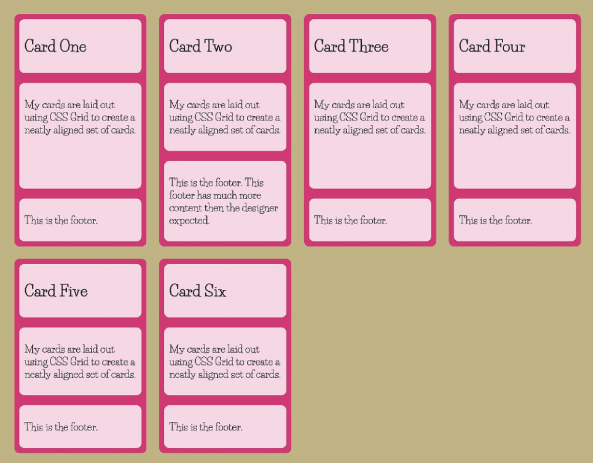
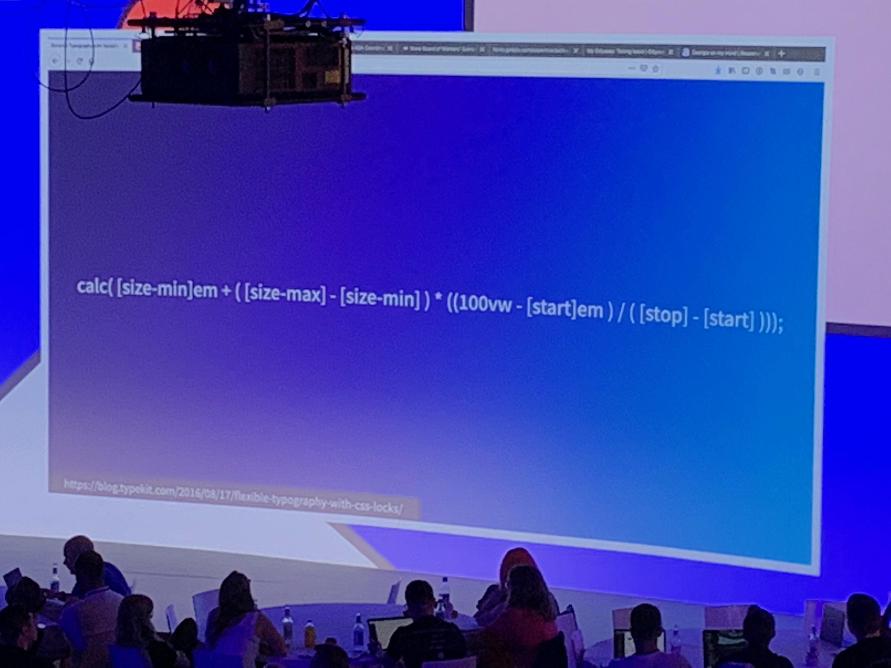
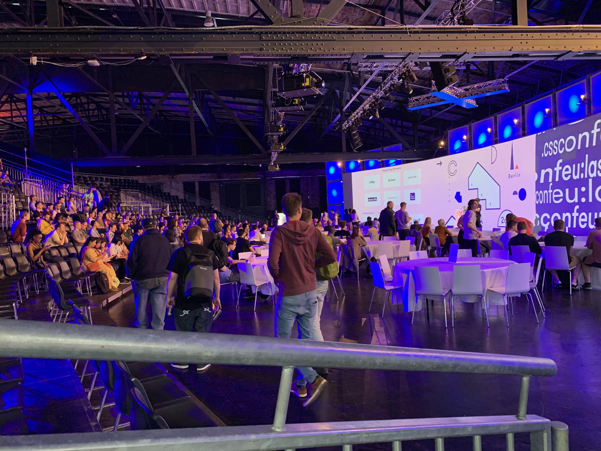

# CSSconf in 5 minuten

Rick en Michel van ilionx Interactive Marketing zijn het hele weekend in Berlijn voor CSSconf 
en JSConf EU 2019. Vandaag was CSSConf. Voor wie er niet bij was, volgen hier korte 
samenvattingen van een paar presentaties, met zoektermen waarmee je zelf meer informatie kunt
vinden.

## [Rachel Andrew - Hello subgrid](https://2019.cssconf.eu/speakers/rachel-andrew/#talk)

Stel je hebt een layout zoals hieronder. De zes kaarten staan in een grid. De header, content
en footer van elk van de kaarten afzonderlijk staat in een eigen grid. Omdat de binnenste
grids van de kaarten onafhankelijk van elkaar zijn, is het ondoenlijk om de footers even hoog
te maken. Met CSS subgrid kun je het binnenste grid koppelen aan de lijnen van het buitenste
grid, en de kaarten wel even hoge footers geven.

*Zoekterm: [CSS subgrid](https://www.google.com/search?q=css+subgrid)* 

## [Chen Hui Jing - Using DevTools to understand modern CSS layouts](https://2019.cssconf.eu/speakers/chen-hui-jing/#talk)

Firefox heeft hele goede developer tools, waarmee je heel goed grids en flexboxes kunt
debuggen. Items in flexboxes kun je op verschillende manieren breedtes geven, en dat kun je
gebruiken om meer controle te krijgen over welke items bij herschalen als eerste moeten 
krimpen en welke pas later. Een width met fr zal eerder gaan herschalen dan een 
minmax of een width auto. 
 
*Zoekterm: [Chen Hui Jing Grid devtools](https://www.google.com/search?q=chen+hui+jing+grid+devtools)
 

## [Jason Pamental - Modern Typographic Systems with Variable Fonts](https://2019.cssconf.eu/speakers/jason-pamental/#talk)

Je kunt met een formule je font automatisch laten meeschalen
met elke gewenste schermgrootte. Met variable fonts kun je meerdere fonts in één 
font-file stoppen, waardoor je veel efficiënter fonts in de browser kunt laden. Er wordt gewerkt aan een manier om variable fonts cumulatief te
laden, zodat je alleen hoeft te laden wat voor de huidige pagina nodig is. Met name voor
grotere fonts, zoals voor Arabisch en Chinees, kan dat een erg belangrijk verschil maken.

*Zoektermen: [variable fonts](https://www.google.com/search?q=variable+fonts), [fluid typography](https://www.google.com/search?fluid+typography)*

## [Gil Tayar - Don’t Believe the Rumors: Writing Tests for CSS is Possible](https://2019.cssconf.eu/speakers/gil-tayar/#talk)

Je kunt CSS alleen visueel testen, door regressietests op pixelniveau uit te voeren. Van
omgevallen tests moet je met de hand controleren of het een fout is of een feature. Cypress is 
een gratis tool dat ook dit soort testing ondersteunt. Ook is er betaalde software 
waarmee je het managen van dit soort tests wat gemakkelijker maakt.

*Zoekterm: [CSS regression test](https://www.google.com/search?q=css+regression+test)*

## [Estefany Aguilar | CSS Logical Properties](https://2019.cssconf.eu/speakers/estefany-aguilar/#talk)

We zijn gewend om pagina's te stylen met top, left, right en bottom. Top-left betekent dat
we aan het begin van onze pagina ruimte willen. Dat werkt in westerse talen. Maar niet in
Arabisch, dat van rechts naar links gaat, of Japans, dat van boven naar beneden gaat. Gebruik
om die talen te ondersteunen liever de logical properties als padding-block-start en
padding-inline-end.

*Zoekterm: [CSS logical properties](https://www.google.com/search?q=CSS+logical+properties)

## [Alex Tait - Class Clash](https://2019.cssconf.eu/speakers/alex-tait/#talk)

Met traditionele semantic CSS krijg je potentieel veel CSS. Met functional
CSS maak je kleine CSS-klassen die je bij elkaar kunt combineren in je HTML
(bijvoorbeeld width-100, background-green). Daardoor krijg je in je HTML meer markup,
maar blijft je CSS kleiner, waardoor het laden van je pagina sneller gaat. 
Tachyons.io is een CSS-library die dit principe toepast. 

*Zoekterm: [Functional CSS](https://www.google.com/search?q=functional+CSS)

## [Samuel Richard - Design System Magic with CSS Houdini](https://2019.cssconf.eu/speakers/samuel-richard/#talk)

CSS Houdini zorgt ervoor dat je kunt interacteren met de CSS engine. Op die manier kun
je door JavaScript te programmeren CSS uitbreiden met je eigen constructies. 

*Zoekterm: [CSS Houdini](https://www.google.com/search?q=functional+CSS)
